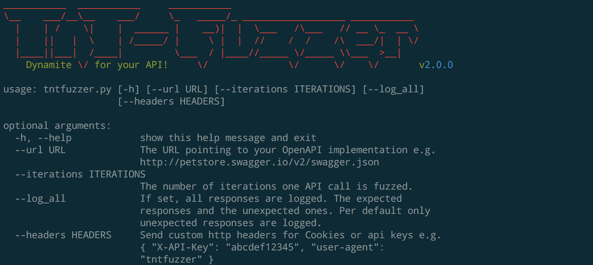

[](https://travis-ci.com/Teebytes/TnT-Fuzzer) [](https://pepy.tech/project/tntfuzzer) [](https://codebeat.co/projects/github-com-teebytes-tnt-fuzzer-master) [](https://github.com/PyCQA/bandit)
============
TnT-Fuzzer is an OpenAPI (swagger) fuzzer written in python. It is like dynamite for your API!

TnT-Fuzzer is designed to make fuzzing, robustness testing and validation of REST APIs easy and maintainable. After the fuzzer runs, the log files state the exact history of requests to reenact a crash or misuse. TnT-Fuzzer can be used
for penetration testing or continued testing of a service in development.

## Installation
TnT-Fuzzer shifted support away from python 2 to  **python 3.7**. If you
need a python 2 compatible source, lookup TnT-Fuzzer Version 1.0.0 and below.

### With docker
Manual installation (see below) can be a little tricky, due to some dependencies not available for **python 3**. If you just want to 
run the fuzzer via the commandline, the installation via docker is a fast and reliable choice. You won't even need a python installation on your system. Just run the docker build with a local tag of your choice:

```
docker build . -t YOUR_TAG
```

Then after the build of the image is complete, running tntfuzzer in a container is as easy as the following:

```
docker run YOUR_TAG python tntfuzzer/tntfuzzer.py --url https://petstore.swagger.io/v2/swagger.json --iterations 100 --log_all
```

This command is equal to the command used in the examples section. For more information on use, see below.

### From source
Checkout git repository. Navigate into fresh cloned repository and install
all dependencies needed. All dependencies are listed in requirements.txt
and can be installed via pip:

```
pip install -r requirements.txt
```

However, at the moment of writing this guide the PyJFuzz dependency available
via [pypi](https://pypi.org/) is outdated only compatible with python 2 only. So,
when problems installing the PyJFuzz dependency occur, install the newest version
of it manually and then install the other dependencies:

```
git clone https://github.com/mseclab/PyJFuzz.git && cd PyJFuzz && python setup.py install
cd ..
pip install -r requirements.txt
```

Then all dependencies should be met and run **tntfuzzer** with:

```
python tntfuzzer/tntfuzzer.py
```

### For Development
There are dependencies only needed for developing the fuzzer. These are listed
in the requirements-dev.txt and can be installed via pip:

```
pip install -r requirements-dev.txt
```

#### Testing

For testing or development, have a look at the [swagger petstore example](http://petstore.swagger.io/). A local stub
server can easily be generated and run locally.

Run software tests using the following command:

```
$ cd tntfuzzer
$ nosetests  tests/core/*.py tests/utils/*.py tests/*.py
........................
----------------------------------------------------------------------
Ran 41 tests in 0.028s

OK
```

## Documentation

### Examples

To get a better hang what can be done with tntfuzzer, print the usage infos:

```
tntfuzzer -h
```



The most important parameter is the **--url**, with the URL to your OpenAPI specification json file.

The parameter **--iterations** will specifiy how often an API call will be fuzzed. If
the **--iterations** parameter is not specified, every API call is fuzzed only once.

Per default only responses that are not documented in your Service's OpenAPI specification are logged. This way only
undocumented errors are logged. If you want all fuzz responses to be logged, you have to specify that by
setting the **--log_all** parameter.

If you want to connect to servers using self-signed certificates, use the **--ignore-cert-errors**.

Sometimes an OpenAPI file will contain an invalid host name, or point to the wrong server. If you use the **--host**
option you can override this without making a local copy of the file. Same happens with **--basepath** that let you
specify a different basepath for the API. 

So following example run will fuzz every API call specified in the swagger.json with 100 permutations each. All
responses received from the server are logged:

```
tntfuzzer --url http://example.com:8080/v2/swagger.json --iterations 100 --log_all
```

### Log

When run, TnT-Fuzzer logs all responses in a table on commandline:

| operation | url | response code | response message | response body | curl command |
|---|---|---|---|---|---|
| get       | http://localhost:8080/v2/apicall | 200 | Successful Operation | {'success': true} | ```curl -XGET -H "Content-type: application/json" -d '{'foo': bar}' 'http://localhost:8080/v2/apicall'``` |
